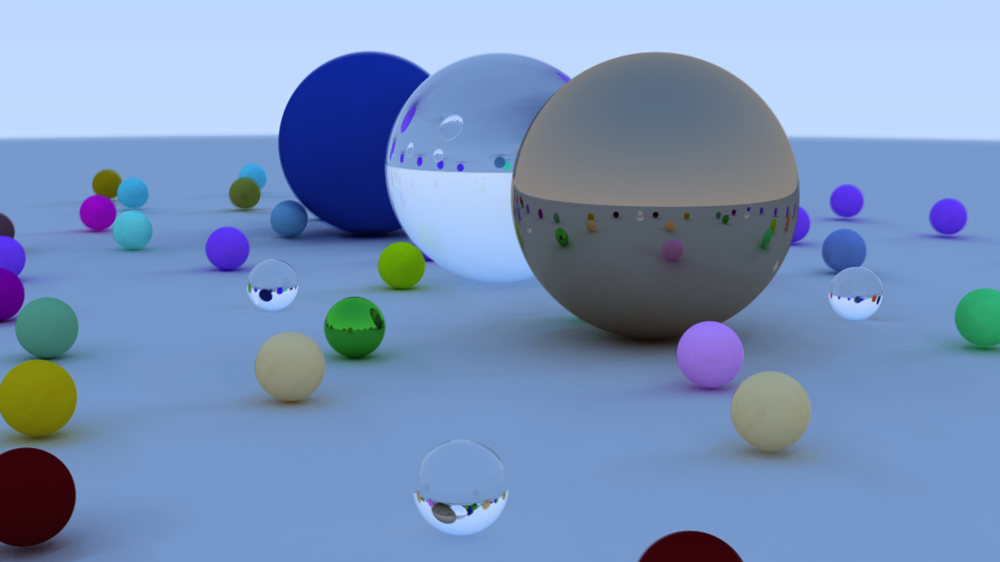
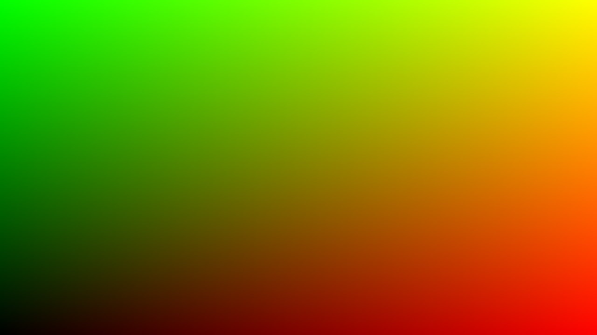
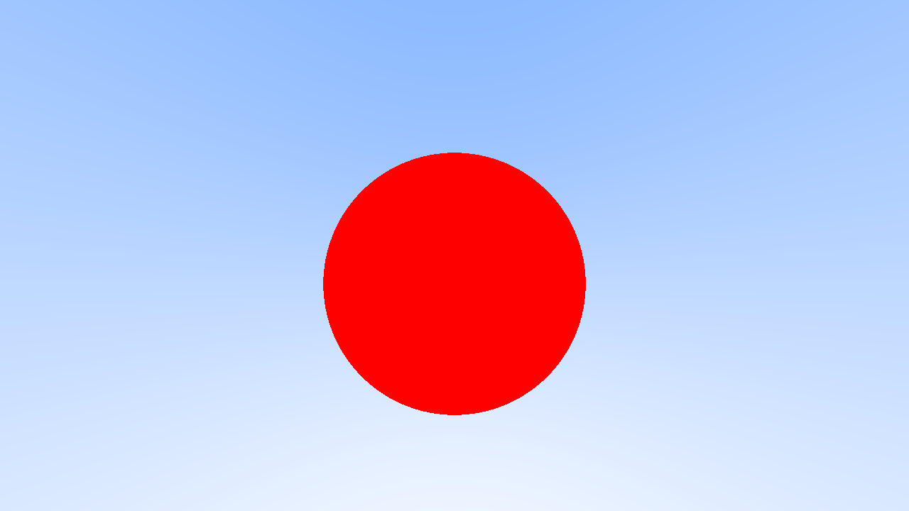
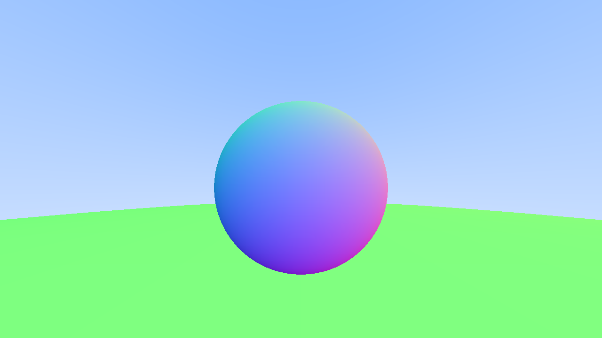
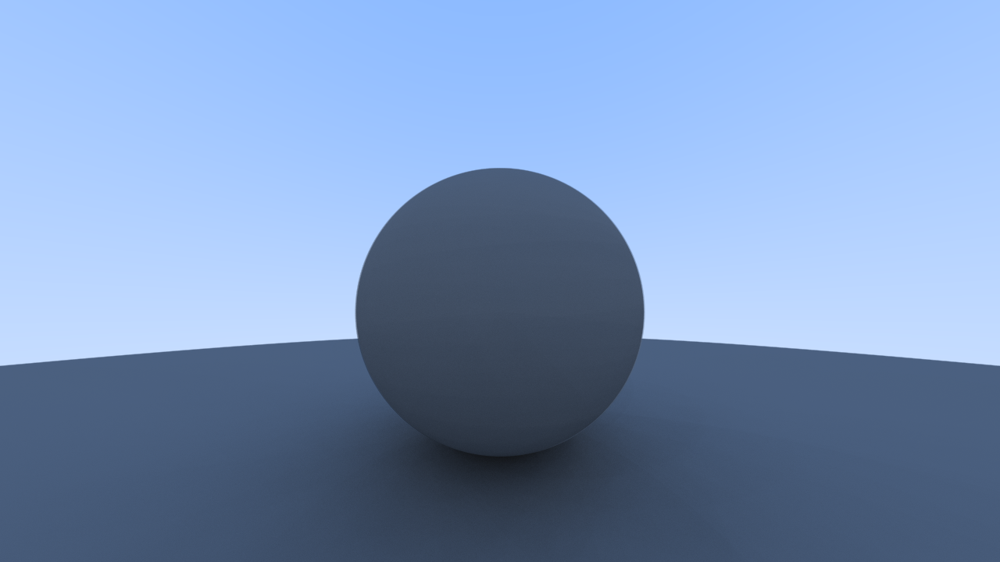
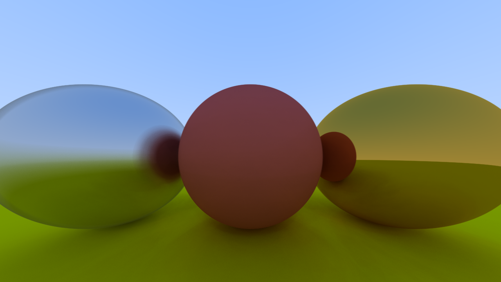
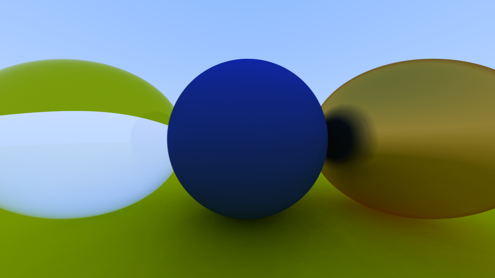
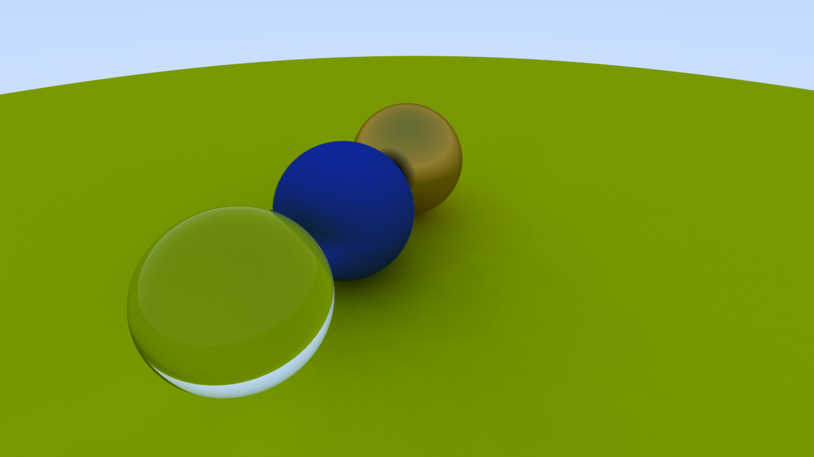
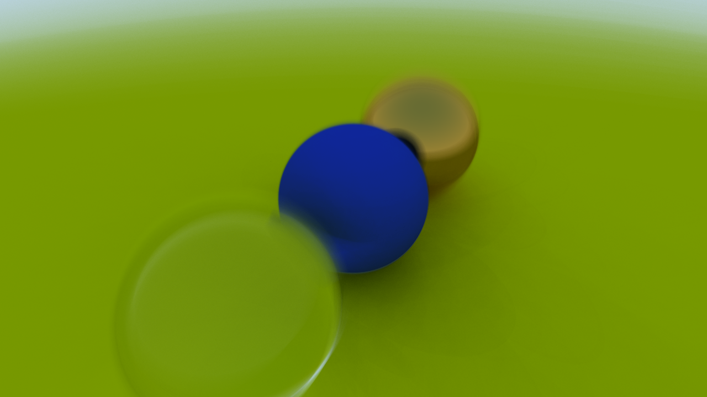

# Ray Tracing in One Weekend

This is an example project going through the famous [Ray Tracing in One Weekend](https://raytracing.github.io/books/RayTracingInOneWeekend.html) book.

The fragment shaders go over each relevant chapter of the book and should output the following images:

### Chapter 2: Output an Image

### Chapter 4: Rays, a Simple Camera, and Background

### Chapter 5: Adding a Sphere

### Chapter 6: Surface Normals and Multiple Objects

### Chapter 7: Antialiasing

### Chapter 8: Diffuse Materials

### Chapter 9: Metal

### Chapter 10: Dielectrics

### Chapter 11: Positionable Camera

### Chapter 12: Defocus Blur

### Chapter 13: Where Next?

